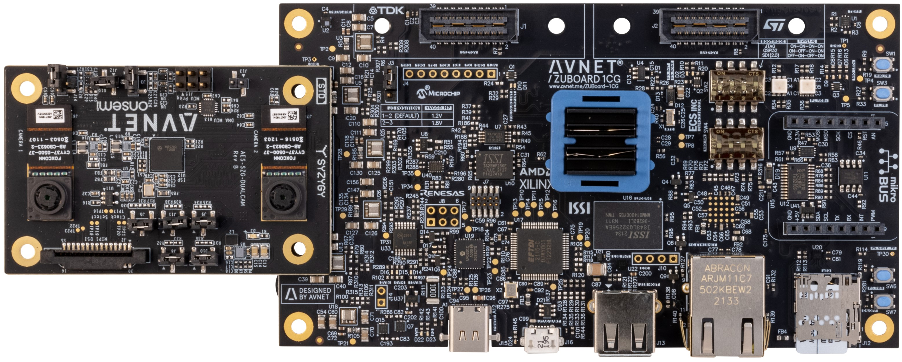
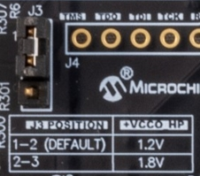
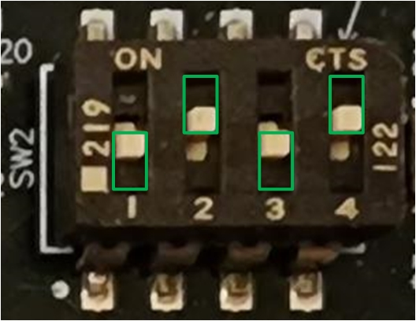
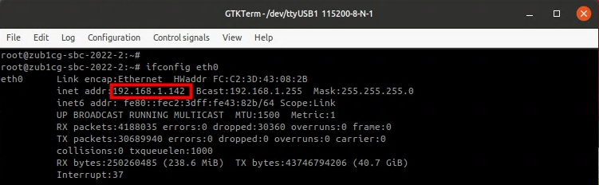
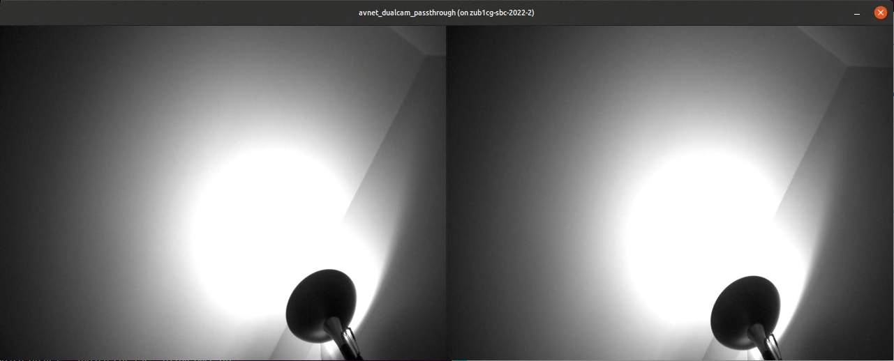
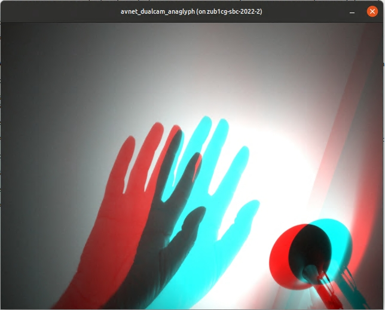

Running the PetaLinux OS Image
==============================

1. After the SDcard has been properly imaged, insert the card into your ZUBoard 1CG board. 

2. Install the DualCam HSIO board on the "J6" HSIO connector. Optionally you may also wish to connect a USB keyboard and a 1080p video monitor (`Avnet DP-eMMC HSIO module <http://avnet.me/dpemmc>`_ required to be installed on the "J2" HSIO connector).

3. Set the J3 jumper on the ZUBoard to 1.2V I/O.  This is required for the MIPI interface for the cameras.

4. Set the boot mode switches (SW2) for SD card boot (1-4 off-on-off-on).

5. Connect the board to the `USB-C power adapter 15V/45W <http://avnet.me/zuboard-usb-supply/>`_ and press the power switch (SW7) to turn on the board.  Once the board boots you will be prompted for login credentials.
    * Login: root (no password required)

6. Open a UART console connection to the ZUBoard 1CG
    * Baud 115200
    * 8 bits
    * No parity
    * 1 stop bit

7. In the UART console for the ZUBoard 1CG, determine the assigned IP address of the ZUBoard.

.. code-block:: console

    # ifconfig eth0

8. Launch a ssh session to the ZUBoard 1CG.

  * On a Windows host PC the MobaXterm  X11 terminal software is needed to run a ssh session. Download MobaXterm for your host at `<https://mobaxterm.mobatek.net/>`_ and install it, then launch MobaXterm and start a new ssh session with the IP address of the ZUBoard 1CG and make sure X11-Forwarding is enabled.

  .. image:: images/mobaxterm_ssh.jpg
      :align: center

  * On a Linux host PC the ssh session can be launched from the command line.

  .. code-block:: console

    # ssh root@<IP address>

  .. image:: images/linux_ssh.jpg
      :align: center

9. At the command prompt change to the **avnet_dualcam_python_examples** folder and launch the Python example.

.. code-block:: console

    $ cd ~/avnet_dualcam_python_examples
    $ python3 ./avnet_dualcam_passthrough.py

10. Press <ctrl>-c to close the demo window.  There is also a Python anaglyph application example that can be run.

.. code-block:: console

    $ python3 ./avnet_dualcam_anaglyph.py

11. Press <ctrl>-c to close the demo window.

Going Further
=============

Check out the many projects and application examples posted on Hackster.io that highlight the use of the Avnet DualCam HSIO module with the ZUBoard 1CG:

* `Robot Control <http://avnet.me/vitis-ai-3.0-robot-control>`_
* `ASL Classification <http://avnet.me/vitis-ai-3.0-asl-classification>`_
* `Accelerated Edge AI <http://avnet.me/avnet-zub1cg-sbc-2022.1>`_

