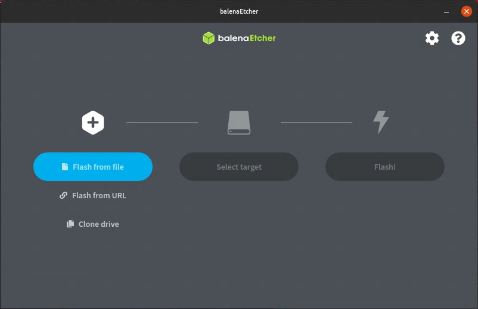
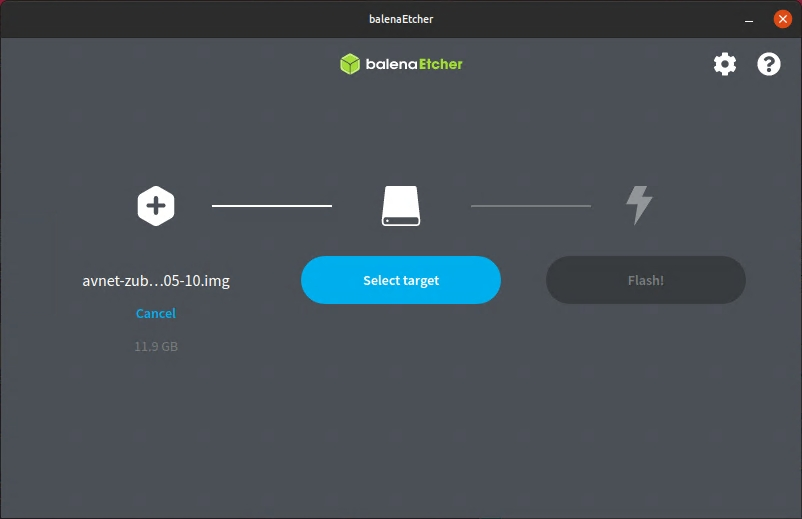
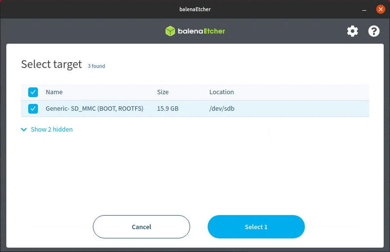
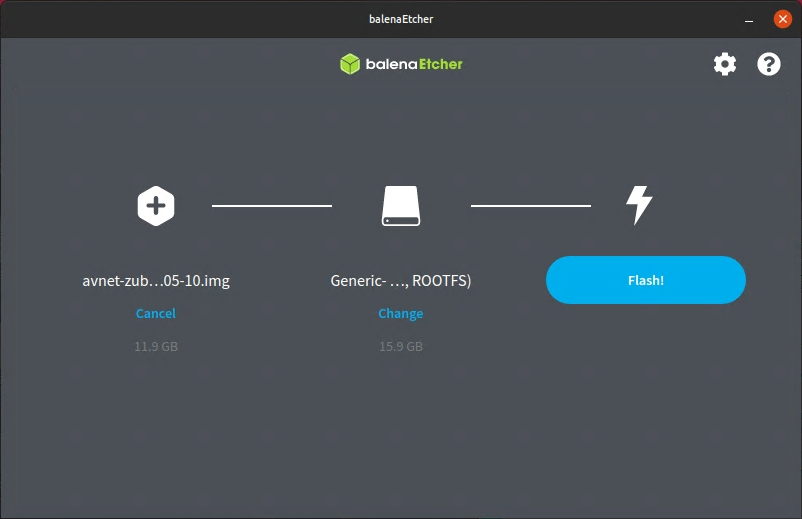
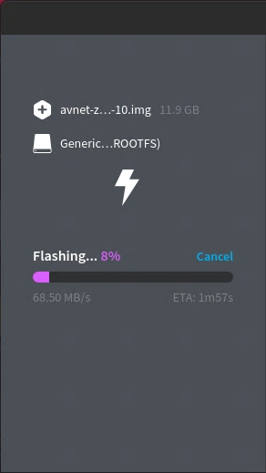
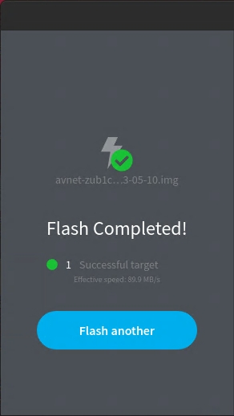

SDcard Image Instructions
=========================

The following procedure will write the ZUBoard 1CG 16GB microSD card with the out of box image for the Dual Camera HSIO module.

**WARNING This procedure will erase everything on the microSD card, so backup anything important prior to running performing this operation.**

1. Download the image archive from `<http://avnet.me/avnet-zub1cg-2022.2-sdimage/>`_
2. Decompress the archive to extract the .img file. You should have a file named avnet-zub1cg_sbc-v2022.2-yyyy-mm-dd.img. The extracted image should be approximately 12 GB large.
3. Download Etcher for your host at `<https://etcher.balena.io/>`_ and install it.
4. Launch Etcher and select **Flash from file**

5. Navigate to the avnet-zub1cg_sbc-v2022.2-yyyy-mm-dd.img file previously extracted and click **Open**.

6. Plug in the microSD card + adapter into your host and note the drive letter. Etcher may find your drive automatically. If not, click **Select target** and browse to the drive letter for your microSD card.

**WARNING Be sure to slect the correct device!  Be careful not to select your system drive!  This procedure will erase everything on the microSD card, so backup anything important prior to running performing this operation.**

7. Click **Flash!** to write the OS image to the microSD card.

8. Etcher will display progress as it writes the OS image to the micro SD card.

9. When complete, Etcher will display **Flash Completed!**

